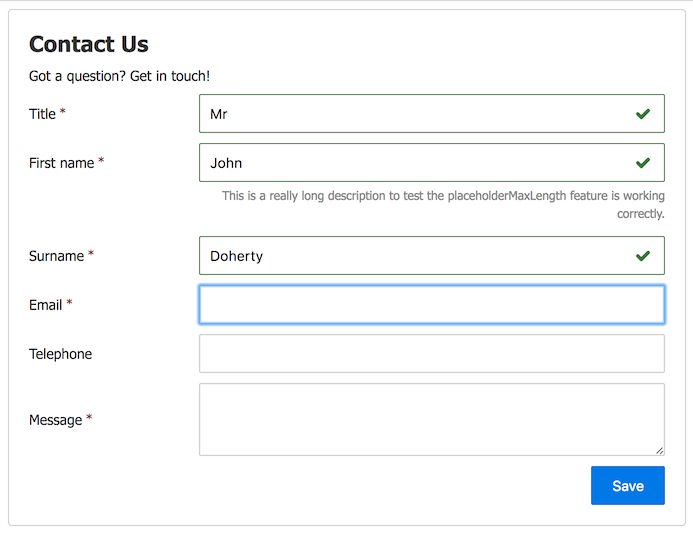

# Pure Form

[](https://www.linkedin.com/in/john-i-doherty) [](https://twitter.com/CambridgeMVP)

Pure Form is a w3c Web Component that uses JSON Schema (v3) to create a typical web form. Removing the need to worry about form markup, validation, layout and UX. The component is written in pure JavaScript (ES5) adhering to web standards, and does not have any dependency on 3rd party frameworks or transpilers.

Benefits:

* No need to hand code a HTML form
* No need to worry about client side validation
* Inline client side error messages take care of
* Get/Set value using a JSON object
* Ability to retrieve schema from server
* Ability to REST POST/PUT form to server as JSON
* Automatic persistance between refreshes _(optional)_
* UX friendly onblur validation _(optional)_

## Usage

```html
<html>
  <head>
    <!-- add document.registerElement polyfill if you need IE & Safari support -->
    <script src="document-register-element.js"></script>

    <!-- add pure-form script & css -->
    <link href="pure-form.css" rel="stylesheet" />
    <script src="pure-form.js"></script>
  </head>
  <body>
    <!-- create just like a regular HTML tag (can also be created using document.createElement) -->
    <pure-form id="example" src="contact-form.json" validate-onblur="true"></pure-form>
  </body>
</html>
```

### JSON Schema

Pure form uses JSON Schema (v3) to define the forms input requirements and validation. If the `contact-form.json` referenced above contained the following JSON Schema (v3):

```json
{
  "type": "object",
  "id": "contact-form",
  "$schema": "http://json-schema.org/draft-03/schema#",
  "title": "Contact Us",
  "description": "Got a question? Get in touch!",
  "links": [
    { "rel": "create", "title": "Save", "href": "http://localhost:8080/contact", "method": "POST" }
  ],
  "properties": {
    "title": {
      "title": "Title",
      "id": "order:010",
      "type": "string",
      "required": true,
      "enum": [
        "Mr",
        "Mrs",
        "Ms"
      ]
    },
    "firstName": {
      "title": "First name",
      "id": "order:020",
      "type": "string",
      "required": true
    },
    "surname": {
      "title": "Surname",
      "id": "order:030",
      "type": "string",
      "required": true,
      "description": "Family name"
    },
    "dateOfBirth": {
      "title": "Email",
      "id": "order:040",
      "type": "string",
      "format": "textarea",
      "required": true
    }
  }
}
```

It would produce the following form, including all validation. The markup created within the `pure-form` tag is just regular HTML and can be [styled accordingly](docs/STYLING.MD).




### Get Form Value

You can get the value of all form fields by calling `.value`:

```js
var data = document.getElementById('example').value;
```

In the above example, the data variable now contains the following:

```js
{
  title: "Mr",
  firstName: "John",
  surname: "Doherty"
}
```


### Set Form Value

To set the value, simply assign a JSON object with keys matching the field names to the `.value` property. For example:

```js
document.getElementById('example').value = {
  title: "Mr",
  firstName: "John",
  surname: "Doherty"
};
```

Keys that are not referenced in the original schema are ignored.

## HTML Attributes

The following HTML attributes can be set directly on the element within your page or via JavaScript using `element.setAttribute(key, value)`

| Attribute | Description |
| :--- |  :--- |
| `src`  | Path to the JSON Schema that defines the form |
| `create-url` | Url to post the form to when the user clicks Create
| `update-url` | Url to post the form to when the user clicks Save
| `readonly` | If true, adds readonly property to all form fields
| `title` | The title to be rendered before the form
| `description` | The description before the form
| `buttons` | Comma separated list of button labels
| `persist` | Partially completed forms survive refreshes _(until browser is closed)_
| `disable-validation` | Disables all form validation
| `placeholder-maxlength` | Max description length to be used as placeholder, values greater than are inlined
| `autofocus-error` | If set to true, sets focus to the first input containing an error after validation
| `validate-onblur` | If set to true, validates each form field as it looses focus _(disabled .autofocusError)_

## JavaScript Properties

The following JavaScript property allows you to interact with the component:

| Property | Type | Default | Description |
| :--- | :--- | :--- | :--- |
| `.src` | _string_ | `""` | Path to the JSON Schema that defines the form |
| `.schema` | _object_ | `null` | Schema object to use |
| `.value` | _object_ | `{}` | Object containing key/value pair of values |
| `.createUrl` | _string_ | `""` | Url to post the form to when the user clicks Create |
| `.updateUrl` | _string_ | `""` | Url to post the form to when the user clicks Save |
| `.readonly` | _boolean_ | `false` | If true, adds readonly property to all form fields |
| `.title` | _string_ | `""` | The title to be rendered before the form |
| `.description` | _string_ | `""` | The description before the form |
| `.buttons` | _string_ | `[]` | Comma separated list of button labels |
| `.persist` | _boolean_ | `false` | Partially completed forms survive refreshes _(until browser is closed)_ |
| `.disableValidation` | _boolean_ | `false` | Disables all form validation |
| `.placeholderMaxLength` | _boolean_ | `75` | Max description length to be used as placeholder, values greater than are inlined
| `.autofocusError`| _boolean_ | `false` | If set to true, sets focus to the first input containing an error after validation
| `.validateOnBlur` | _boolean_ | `false` | If set to true, validates each form field as it looses focus _(disabled .autofocusError)_

## Methods

| Method | Returns | Description |
| :--- | :--- | :--- |
| `.clearValidationErrors()` | - | Clear all form validation error messages |
| `.setInvalid(fieldNameAsString, errorAsString)` | - | Sets a form field to invalid with a custom error message |
| `.setValid(fieldNameAsString)` | - | Sets a form field to valid, clearing an error message |
| `.validateField(keyAsString, valueAsAny)` | _Boolean_ | Checks if a key/value is valid against the schema |
| `.isValid()` | _boolean_ | Checks if the entire form is valid |

## Events

Pure Form fires events using w3c [CustomEvent](https://developer.mozilla.org/en/docs/Web/API/CustomEvent) method, additional information is stored within the .detail property of the event object.

| Event | Description | .detail Contains |
| :--- | :--- | :--- |
| `schema-loaded` | Fired when `.src` url is successfully loaded | _schema url_ |
| `schema-errored` | Fired when `.src` url fails to return a JSON Schema | _schema url_ |
| `render-complete` | Fired when pure-form completes rendering | _null_ |
| `button-clicked` | Fired when a pure-form button is clicked | _button display value_ |
| `value-set` | Fired when the form value is set | _null_ |
| `submit-successful` | Fired when form successfully submited to the server (200 response) | _response data_ |
| `submit-failed` | Fired when form failed to successfully submit to server | _submission url_ |


## Data Types

TODO: Add JSON Schema data type/format to html type documentation

## Further Development

This project includes everything needed to fork and continue development, including an embedded node webserver. To run the server, git clone the project and run:

```bash
npm install
npm start
```

Then visit [http://localhost:8080](http://localhost:8080) in your browser.

## Unit Test

Pure Form is tested using [JSDom](https://github.com/tmpvar/jsdom), [Nock](https://github.com/node-nock/nock) and [Jasmine-Node](https://github.com/mhevery/jasmine-node). Tests can be run by git cloning the project and executing:

```bash
npm install
npm test
```

## Build

To create a new version of the minified [pure-form.min.js](dist/pure-form.min.js) and [pure-form.min.css](dist/pure-form) files from source, run the following command:

```bash
npm run build
```

## Reporting Bugs

If you find a bug, please create a [jsfiddle](https://jsfiddle.net) to replicate the bug before raising an issue and attach it to the post.

## Pull Requests

Feel free to submit a PR requests, but please ensure your work is covered by unit tests and follows the current ESLint coding style defined in the [package.json](package.json) file.

## License

Licensed under [MIT License](LICENSE) &copy; [John Doherty](http://www.johndoherty.info)