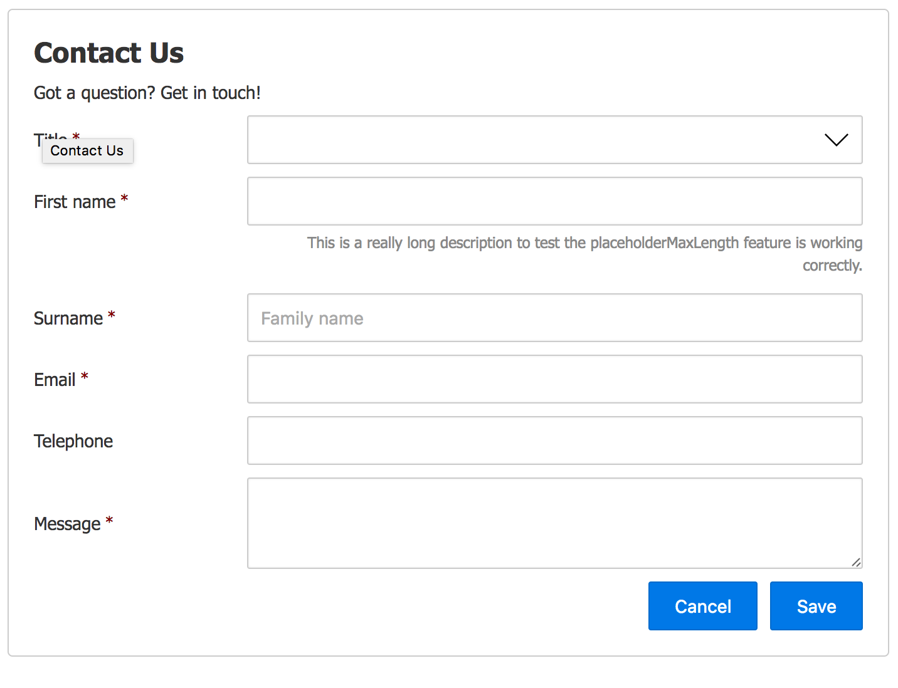

# Pure Form

[](https://www.linkedin.com/in/john-i-doherty) [](https://twitter.com/CambridgeMVP)

Pure Form is a w3c Web Component that uses JSON Schema (v3) to create a typical web form. Removing the need to worry about form markup, validation, layout and UX. The component is written in pure JavaScript (ES5) and does not have any dependency on 3rd party frameworks or transpilers.

## Usage

```html
<html>
  <head>
    <!-- add document.registerElement polyfill if you need IE & Safari support -->
    <script src="polyfills/document-register-element.js"></script>

    <!-- add pure-form script & css -->
    <link href="src/pure-form.css" rel="stylesheet" />
    <script src="src/pure-form.js"></script>
  </head>
  <body>
    <!-- create just like a regular HTML tag (can also be created using document.createElement) -->
    <pure-form src="schemas/contact-form.json" buttons="Cancel, Save"></pure-form>
  </body>
</html>
```

## JSON Schema

Pure form uses JSON Schema (v3) to define the forms input requirements and validation. If the `contact-form.json` referenced above contained the following JSON Schema (v3):

```json
{
  "type": "object",
  "id": "contact-form",
  "$schema": "http://json-schema.org/draft-03/schema#",
  "title": "Contact Us",
  "description": "Got a question? Get in touch!",
  "properties": {
    "title": {
      "title": "Title",
      "id": "order:010",
      "type": "string",
      "required": true,
      "enum": [
        "Mr",
        "Mrs",
        "Ms"
      ]
    },
    "firstName": {
      "title": "First name",
      "id": "order:020",
      "type": "string",
      "required": true
    },
    "surname": {
      "title": "Surname",
      "id": "order:030",
      "type": "string",
      "required": true,
      "description": "Family name"
    },
    "dateOfBirth": {
      "title": "Email",
      "id": "order:040",
      "type": "string",
      "format": "textarea",
      "required": true
    }
  }
}
```

It would produce the following form:



The HTML it creates within the `pure-form` tag is just regular HTML and can be [styled accordingly](docs/STYLING.MD).

### HTML Attributes

The following HTML attributes can be set directly on the element within your page or via JavaScript using `element.setAttribute(key, value)`

| Attribute | Description |
| :--- |  :--- |
| `src`  | Path to the JSON Schema that defines the form |
| `create-url` | Url to post the form to when the user clicks Create
| `update-url` | Url to post the form to when the user clicks Save
| `readonly` | If true, adds readonly property to all form fields
| `title` | The title to be rendered before the form
| `description` | The description before the form
| `buttons` | Comma separated list of button labels
| `persist` | Partially completed forms survive refreshes _(until browser is closed)_
| `disable-validation` | Disables all form validation
| `placeholder-maxlength` | Max description length to be used as placeholder, values greater than are inlined

### JavaScript Properties

| Property | Type | Default | Description |
| :--- | :--- | :--- | :--- |
| `.src` | _string_ | `""` | Path to the JSON Schema that defines the form |
| `.schema` | _object_ | `null` | Schema object to use |
| `.value` | _object_ | `{}` | Object containing key/value pair of values |
| `.createUrl` | _string_ | `""` | Url to post the form to when the user clicks Create |
| `.updateUrl` | _string_ | `""` | Url to post the form to when the user clicks Save |
| `.readonly` | _boolean_ | `false` | If true, adds readonly property to all form fields |
| `.title` | _string_ | `""` | The title to be rendered before the form |
| `.description` | _string_ | `""` | The description before the form |
| `.buttons` | _string_ | `[]` | Comma separated list of button labels |
| `.persist` | _boolean_ | `false` | Partially completed forms survive refreshes _(until browser is closed)_ |
| `.disableValidation` | _boolean_ | `false` | Disables all form validation |
| `.placeholderMaxLength` | _boolean_ | `75` | Max description length to be used as placeholder, values greater than are inlined

### Methods

| Method | Returns | Description |
| :--- | :--- | :--- |
| `.clearValidationErrors()` | - | Clear all form validation error messages |
| `.setInvalid(fieldNameAsString, errorAsString)` | - | Sets a form field to invalid |
| `.setValid(fieldNameAsString)` | - | Sets a form field to valid |
| `.validateField(keyAsString, valueAsAny)` | _Boolean_ | **Checks if a key/value is valid against the schema |
| `.isValid()` | _boolean_ | **Checks if the entire form is valid |

### Events

| Event | Description |
| :--- | :--- |
| `loaded` | This event is fired when the JSON schema set via `.src` property is successfully loaded. `.schema` property exposes the newly loaded JSON schema object | |
| `loaderror` | This event is fired when the component fails to load the JSON schema from the `.src` property |


### Data Types

TODO: add schema data type/format to html type

## Reporting Bugs

If you find a bug, please create a [jsfiddle](https://jsfiddle.net) to replicate the error before raising an issue. Attach the jsfiddle as a link to the issue so I can replicate the error and work out a solution.

## Pull Requests

If you submit a PR, please ensure you include unit tests.

## License

Licensed under [MIT License](LICENSE) &copy; [John Doherty](http://www.johndoherty.info)